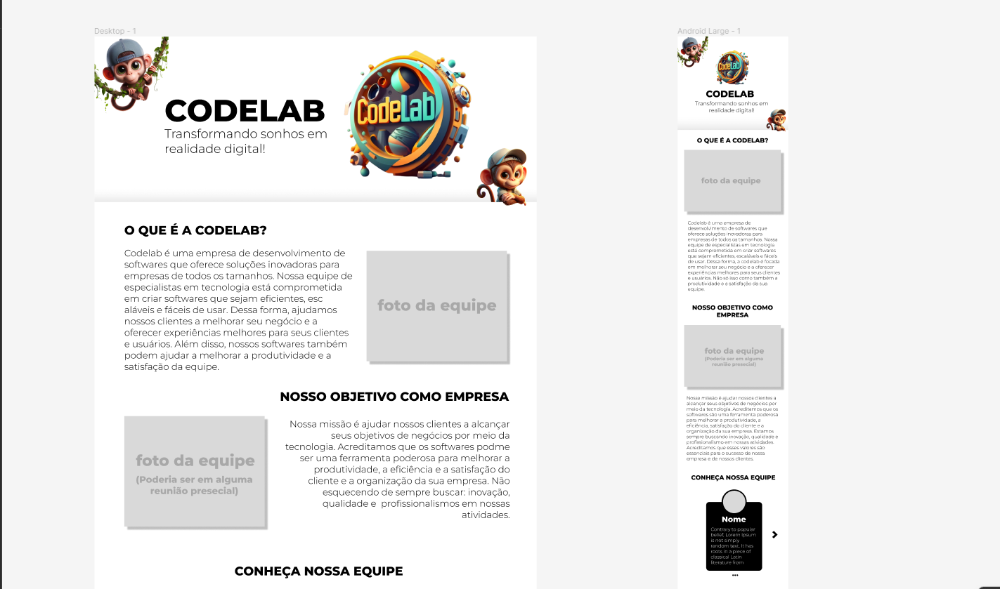
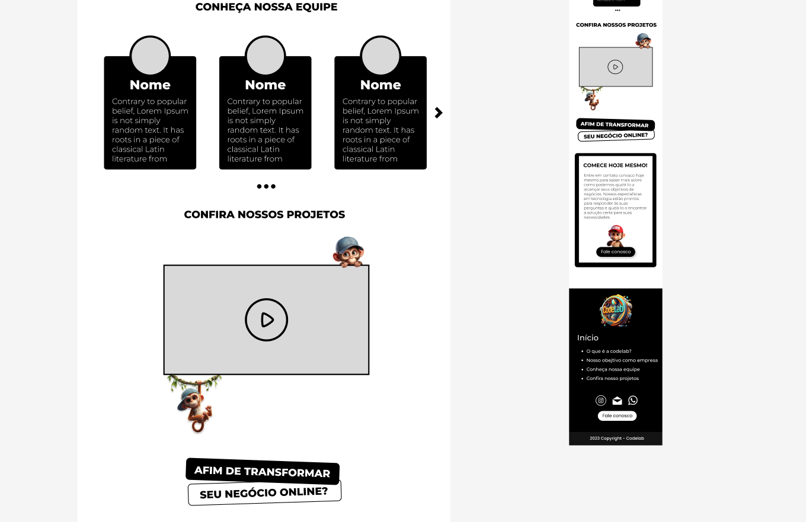

# 💻 CodeLab — Portfólio Colaborativo em Equipe

<div align="center">
  
  
  
  
  <a href="https://cauahenry.github.io/Projetos/"></a>
</div>

<br/>

Projeto de portfólio colaborativo desenvolvido pela equipe **CodeLab**, com minha participação direta e ativa no desenvolvimento **Front-end** e arquitetura de interfaces.

O objetivo do projeto foi criar uma vitrine interativa e visualmente marcante para apresentar os projetos, soluções digitais, metodologias e membros da equipe desenvolvedora.

🔗 **Demonstração ao vivo:** [cauahenry.github.io/Projetos](https://cauahenry.github.io/Projetos/)

---

## 📸 Demonstração Visual

<div align="center">
  
  <br/><br/>
  
</div>

---

## 🌟 Funcionalidades & Destaques

- **Identidade Visual Marcante**: Branding exclusivo da equipe CodeLab com mascote, cores contrastantes e elementos visuais ilustrados.
- **Carrosséis Interativos**: Integração com **Swiper.js** para navegação fluida entre os projetos em destaque e depoimentos.
- **Responsividade Total**: Construído com o grid do **Bootstrap 5**, garantindo adaptação a qualquer resolução de tela (mobile-first).
- **Seção da Equipe**: Apresentação dos membros desenvolvedores e suas respectivas especialidades técnicas.
- **Área de Serviços & Soluções**: Demonstração de competências em desenvolvimento web, interfaces e integrações.
- **Deploy Contínuo**: Hospedagem e entrega automatizada via **GitHub Pages**.

---

## 🛠️ Tecnologias Utilizadas

- **HTML5**: Estrutura semântica e acessível.
- **CSS3 Personalizado**: Estilização complementar, efeitos de sombra, transições e posicionamento relativo/absoluto de ilustrações.
- **Bootstrap 5.3**: Componentes de interface, utilitários de espaçamento, tipografia e sistema de grid.
- **Swiper.js**: Carrosséis modernos com suporte a gestos de toque (*touch swipe*).
- **Bootstrap Icons**: Ícones vetoriais modernos.
- **Google Fonts**: Tipografia *Montserrat*.

---

## 📁 Estrutura do Projeto

```
Projetos/
│
├── index.html                 # Página principal do portfólio
├── style.css                  # Estilos globais e customizações da interface
├── IMG/                       # Imagens da equipe, ilustrações, logotipos e ícones
├── PortfolioCodeLab.png       # Screenshot de demonstração 1
├── PortfolioCodeLab2.png      # Screenshot de demonstração 2
└── PortfolioCodeLab3.png      # Screenshot de demonstração 3
```

---

## 🚀 Como Visualizar Localmente

Não requer instalação de dependências ou build!

1. Clone o repositório:
   ```bash
   git clone https://github.com/cauahenry/Projetos.git
   ```
2. Abra a pasta do projeto:
   ```bash
   cd Projetos
   ```
3. Abra o arquivo `index.html` diretamente no seu navegador, ou utilize extensões como **Live Server**.

---

## 👥 Equipe & Contribuições

Projeto desenvolvido colaborativamente pela equipe **CodeLab**.
- **Front-end & UI**: Cauã Henry ([GitHub](https://github.com/cauahenry) | [LinkedIn](https://linkedin.com/in/cauahenry))
